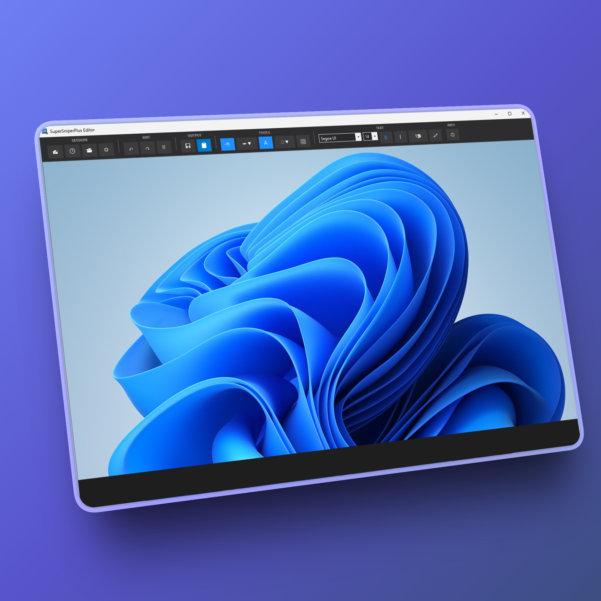
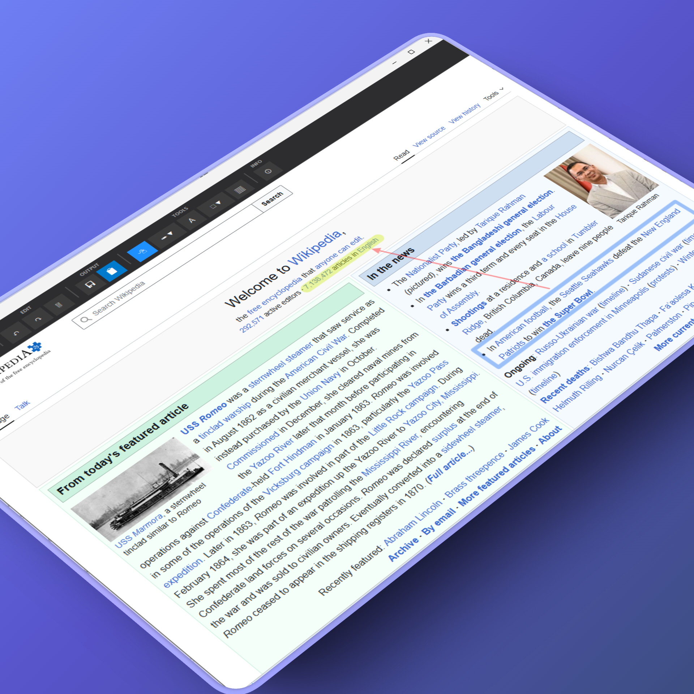
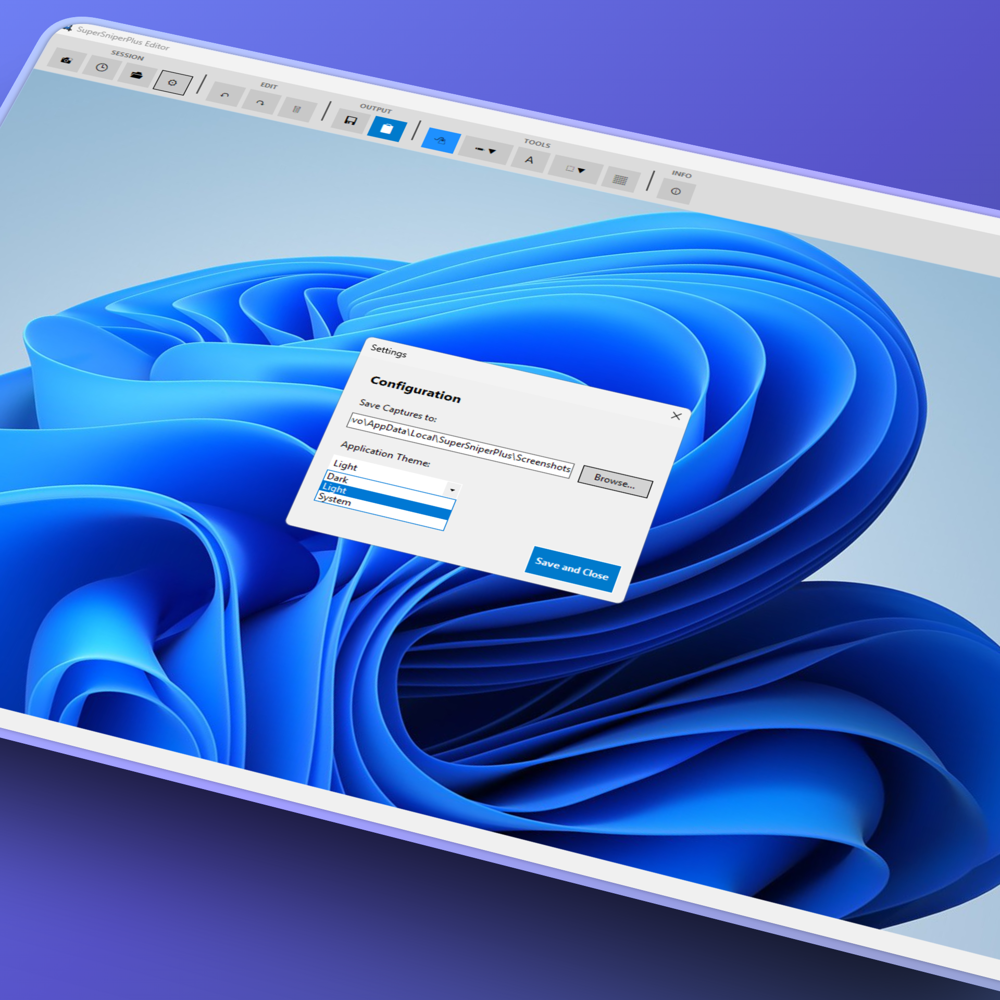

# 
# SuperSniperPlus

**SuperSniperPlus** is a powerful, lightweight screen capture and image editing tool built for Windows. It streamlines the process of capturing, annotating, and sharing screenshots without cluttering your desktop.

## 📸 A look at SuperSniperPlus

https://github.com/user-attachments/assets/171b31a2-3789-4eb3-8f6b-700698fd89cf

**Main Interface (Dark Mode)**

**Precision Tools**

**Pixelated censorship**

**Personalization and Themes**

## ✨ Key Features

* **Smart Selection**: Capture any area of your screen with multi-monitor support.
* **Contextual UI**: A clean interface where editing tools (Text/Shapes) only appear when you need them.
* **Pro Annotations**: Add arrows, rectangles, circles, lines, and text with custom fonts and colors.
* **Privacy First**: Built-in **Pixelate** tool to hide sensitive information instantly.
* **Auto-Save & Copy**: One-click saving to `AppData` while automatically copying the image to your clipboard.
* **Visual History**: Quickly browse and re-edit your previous captures.
* ✨ New: Free drawing tool (Pencil, Marker, Highlighter, Brush).
* ✨ New: Support for Dark Theme (Dark Mode) and saved settings.
* ⌨️ Added keyboard shortcuts (Ctrl+S, Ctrl+C, Ctrl+Z, etc.).
* 📐 Hold ALT to draw straight lines or proportional shapes.
* **Get a link**: Starting with v.1.1.3-beta you can upload your images to the cloud and get a link without logging in. You can choose to upload them to your own account using your own imgbb API Key.

## 🚀 Installation & Download

1.  Go to the [**Releases**](https://github.com/gustavoxntc/SuperSniperPlus-App/releases) section.
2.  Download the latest `SuperSniperPlus_vX.X.X-beta.zip` file.
3.  Unzip and run the .exe file to launch the app.
4.  The app will live in your **System Tray**. Use the global shortcut to start snipping!

## ⌨️ Quick Shortcuts

| Shortcut | Action |
| :--- | :--- |
| **Alt + S** | Trigger new screen capture (Global) |
| **Esc** | Cancel snip or close the editor |
| **Ctrl + Z** | Undo last action |
| **Ctrl + Y** | Redo last action |
| **Delete/Supr** | Remove selected object |
| **Ctrl + H** | Open History |

## 📖 Documentation

For a detailed guide on how to use the editing tools and manage your storage, visit our [**Project Wiki**](https://github.com/gustavoxntc/SuperSniperPlus-App/wiki).

## 🛡️ License

This project is licensed under the **MIT License** - see the [LICENSE](LICENSE) file for details.

---

### 👤 Author
**Gustavo De Abreu** 
## 

