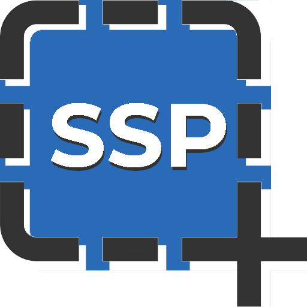
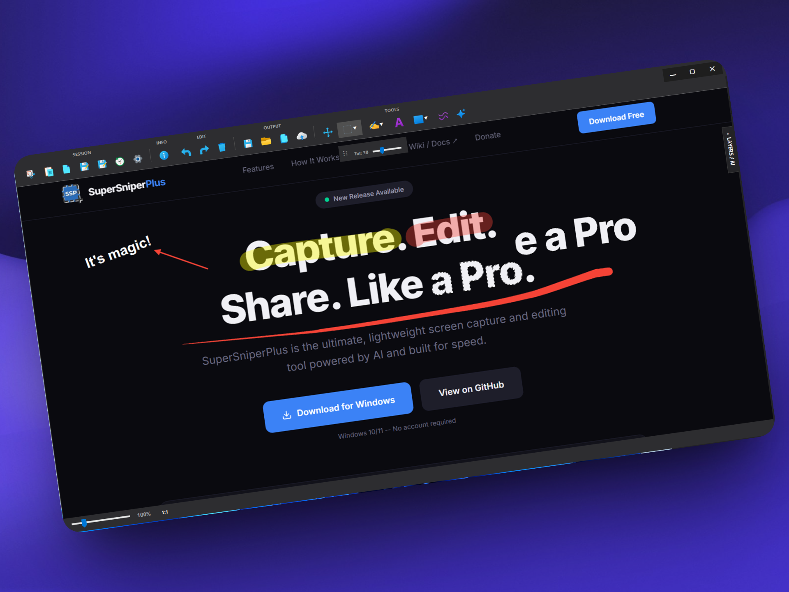
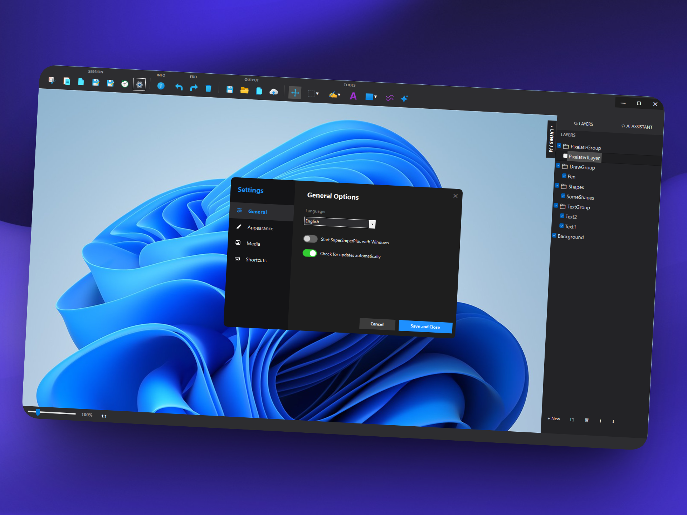
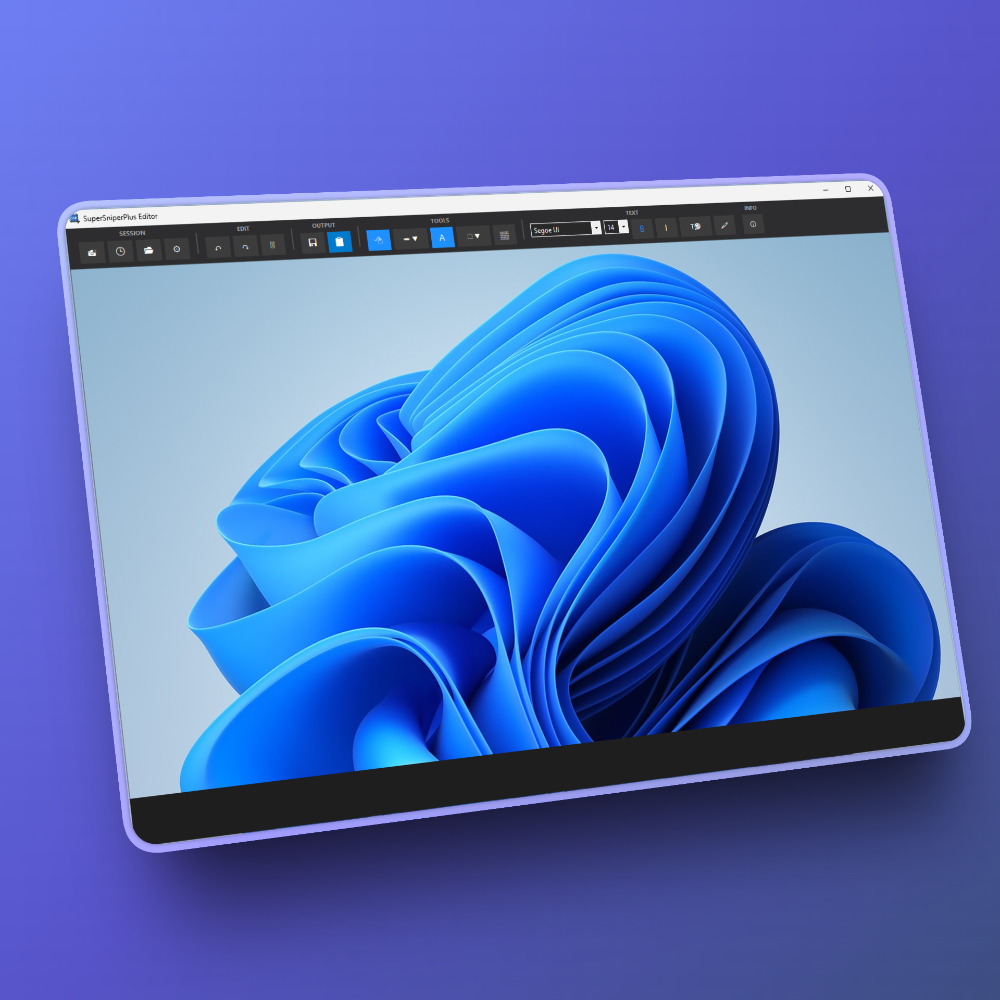
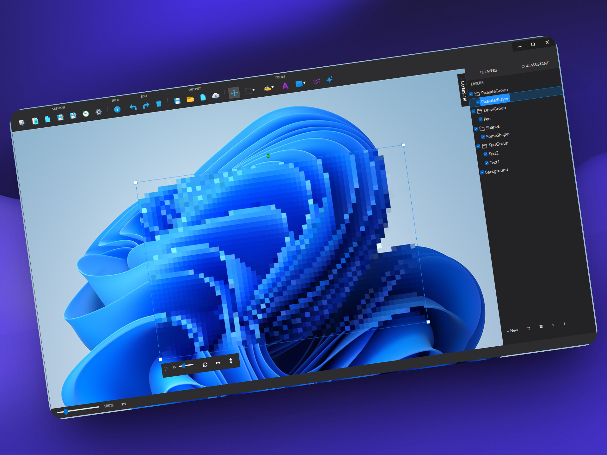

# 
# SuperSniperPlus

**SuperSniperPlus** is a powerful, lightweight screen capture and image editing tool built for Windows. It streamlines the process of capturing, annotating, and sharing screenshots without cluttering your desktop.

## 📸 A look at SuperSniperPlus

https://github.com/user-attachments/assets/438658f7-c473-487a-b859-e0f6be8870ff

**Precision Tools**

**Personalization and Themes**

**Main Interface (Dark Mode)**

**Pixelated censorship**

### ✨ Key Features

**✂️ Pro-Level Selection & Masking (NEW)**
* **Magic Wand Tool:** Instantly select contiguous colors with adjustable tolerance and a visual "Quick Mask" preview.
* **Advanced Lassos:** Draw freehand shapes or use the Polygon tool to click point-by-point for precise geometric cuts.
* **Multi-Selection:** Hold `Shift` to accumulate multiple selections (mix rectangles, lassos, and magic wand areas) before copying.
* **Transparent Clipboard:** Copy irregular or curved selections and paste them anywhere (Discord, Photoshop, etc.) with a perfect, 100% transparent PNG background.

**🎨 Powerful Editing & Annotations**
* **Pro Annotations:** Add arrows, rectangles, circles, lines, and text with custom fonts, colors, and backgrounds.
* **Freehand Drawing:** Choose from Pencil, Marker, Highlighter (with real transparency blending), Brush, and Eraser.
* **Object Transformation:** Select any drawn object or text to move, resize, rotate 360°, or flip horizontally/vertically.
* **External Pasting:** Press `Ctrl+V` to paste any image from your clipboard directly into your current canvas.
* **Privacy First:** Built-in Pixelate tool to hide sensitive information instantly with adjustable blur intensity.

**🖥️ Seamless Workflow & UI**
* **Contextual Floating Toolbar:** Editing tools and sliders appear dynamically near the object you are editing, keeping the interface clean.
* **Canvas Navigation:** Zoom in/out (from 10% to 500%) using `Ctrl + MouseWheel` and Pan across large images using `Middle Click` or `Alt + Click`.
* **System Tray & Global Hotkeys:** Runs quietly in the background. Take captures instantly with customizable global shortcuts (e.g., `Alt+S`), even if the app is minimized.
* **Modern Settings Panel:** A sleek, Windows 11-style interface with vertical tabs, iOS-style toggle switches, and full support for Dark, Light, and System themes.
* **Visual History:** Press `Ctrl+H` to quickly browse, search, and re-edit your previous captures.

**☁️ Export & Cloud Integration**
* **Instant Cloud Upload:** Upload directly to ImgBB without logging in. Generates automatic ready-to-use codes (Direct URL, HTML, Markdown, BBCode). Supports custom API keys.
* **Auto-Save:** One-click saving to your local AppData folder while automatically copying the image to your clipboard.
* **Built-in Auto-Updater:** Silently checks GitHub for new releases and notifies you when a new version is available with a 1-click update prompt.
## 🚀 Installation & Download

1.  Go to the [**Releases**](https://github.com/gustavoxntc/SuperSniperPlus-App/releases) section.
2.  Download the latest `SuperSniperPlus_vX.X.X-beta.zip` file.
3.  Unzip and run the .exe file to launch the app.
4.  The app will live in your **System Tray**. Use the global shortcut to start snipping!

## ⌨️ Quick Shortcuts

| Shortcut | Action |
| :--- | :--- |
| **Alt + S** | Trigger new screen capture (Global) - *Default, but you can change it from Settings* |
| **Esc** | Cancel snip or close the editor |
| **Ctrl + S** | Save image to disk |
| **Ctrl + C** | Copy to clipboard *(Supports transparent backgrounds for Lasso/Magic Wand)* |
| **Ctrl + X** | Cut selection *(Erases the area and copies it to clipboard)* |
| **Ctrl + V** | Paste image from clipboard into the canvas |
| **Ctrl + Z** | Undo last action |
| **Ctrl + Y** | Redo last action |
| **Ctrl + H** | Open Visual History |
| **Delete / Supr** | Remove the currently selected object |
| **Hold Shift + Select** | Multi-selection: Combine multiple areas (Region, Lasso, Magic Wand) |
| **Shift + Drag Corners** | Resize Rectangles and Circles proportionally |
| **Hold Shift + Mouse** | Draw straight lines while using the Freehand Lasso tool |
| **Right Click** | Cancel the current Polygonal selection |
| **Alt + Hold Right Mouse** | Straight pencil strokes |
| **Ctrl + +** | Zoom In |
| **Ctrl + -** | Zoom Out |
| **Ctrl + 0** | Reset Zoom to 100% |
| **Ctrl + Mouse Wheel** | Zoom In/Out focusing on the mouse pointer |
| **Hold Alt + Hold Left Mouse**| Move Image (Pan tool) |
| **Hold Mouse Wheel** | Move Image (Pan tool) |

## 📖 Documentation

For a detailed guide on how to use the editing tools and manage your storage, visit our [**Project Wiki**](https://github.com/gustavoxntc/SuperSniperPlus-App/wiki).

## 🛡️ License

This project is licensed under the **MIT License** - see the [LICENSE](LICENSE) file for details.

---

### 👤 Author
**Gustavo De Abreu** 
## 

